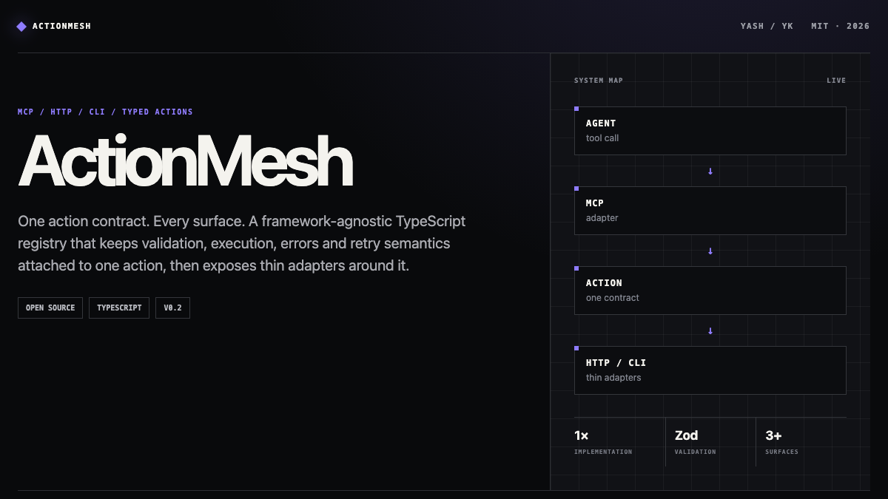
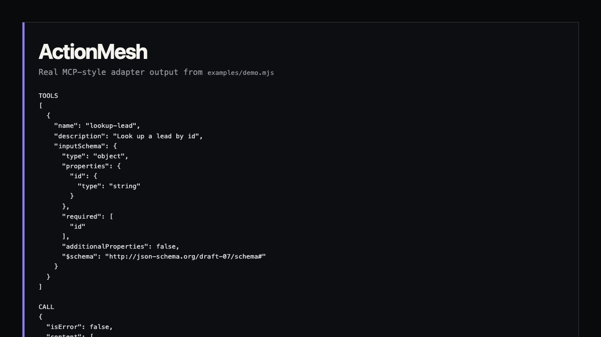
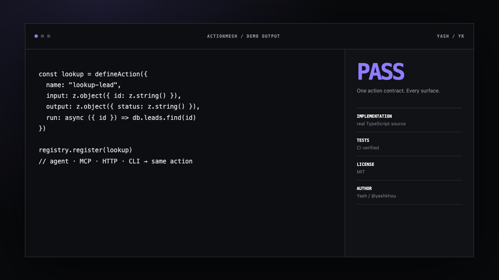

<p align="center">
  
</p>

<p align="center">
  <a href="https://github.com/yashkhou/actionmesh/actions/workflows/ci.yml"></a>
  <a href="https://github.com/yashkhou/actionmesh/releases/latest"></a>
  <a href="./LICENSE"></a>
  
  <a href="https://yashkhou.github.io/actionmesh/"></a>
</p>

<p align="center">
  <strong>One action contract. Every surface.</strong><br>
  A framework-agnostic TypeScript action registry that keeps validation, execution, errors and retry semantics attached to one operation, then exposes thin adapters around it.
</p>

<p align="center">
  <a href="https://yashkhou.github.io/actionmesh/"><strong>Live docs</strong></a> ·
  <a href="https://yashkhou.github.io/actionmesh/real-demo.html"><strong>Open the real adapter demo</strong></a> ·
  <a href="https://yashkhou.com/projects/actionmesh"><strong>Project page</strong></a> ·
  <a href="https://github.com/yashkhou/actionmesh/releases/latest"><strong>Latest release</strong></a>
</p>



## Why I built this

The same capability often gets rewritten as a backend route, an agent tool, a CLI script and an MCP handler. Those copies drift. ActionMesh keeps one implementation and treats transports as adapters—not new places for business logic.

## What ships today

- Typed `defineAction()` contracts
- Zod input validation before execution
- Optional output validation
- Stable machine-readable `ActionMeshError` codes
- Retries only when explicitly retryable
- MCP-style `listTools()` / `callTool()` adapter
- Node HTTP handler and CLI invocation helper

## Real demo

This screenshot comes from the repository's executable demo—not a design mockup.



**[Open the real adapter demo →](https://yashkhou.github.io/actionmesh/real-demo.html)**

## Quick start

```bash
git clone https://github.com/yashkhou/actionmesh.git
cd actionmesh
npm install
npm test
npm run build
node examples/demo.mjs
```

## Small example

```ts
const registry = new ActionRegistry().register(defineAction({
  name: "lookup-lead",
  description: "Look up a lead by id",
  input: z.object({ id: z.string() }),
  output: z.object({ id: z.string(), status: z.string() }),
  run: async ({ id }) => ({ id, status: "active" }),
}));

await registry.invoke("lookup-lead", { id: "lead_123" });
```

## Architecture

```mermaid
flowchart LR
    A[UI / app] --> E[Action contract]
    B[Agent] --> E
    C[MCP-style adapter] --> E
    D[HTTP / CLI] --> E
    E --> F[Input schema]
    F --> G[run()]
    G --> H[Output schema]
    H --> I[One result / error contract]
```

The design rule is intentionally narrow: **one action owns the contract; adapters translate transports without reimplementing business logic.**

## Good fits

- Keep an agent tool and application API on the same implementation
- Generate tool schemas from the same runtime validation
- Centralize retryable vs deterministic failures
- Reuse backend operations from scripts and CI without duplicating logic

## Visual system

The docs and repository assets are deliberately part of the project rather than generic GitHub decoration.



## Roadmap

- [ ] Official Model Context Protocol transport package
- [ ] OpenAPI generation
- [ ] Action middleware and authorization policies
- [ ] Structured audit hooks
- [ ] Concurrency and idempotency policies

## Development

```bash
npm install
npm test
npm run build
```

CI runs tests and the TypeScript build on every push and pull request.

## Project links

- **Docs:** https://yashkhou.github.io/actionmesh/
- **Portfolio:** https://yashkhou.com/projects/actionmesh
- **Source:** https://github.com/yashkhou/actionmesh
- **Author:** [Yash](https://github.com/yashkhou) / [@yashkhou](https://x.com/yashkhou)

## License

MIT. See [LICENSE](./LICENSE).
